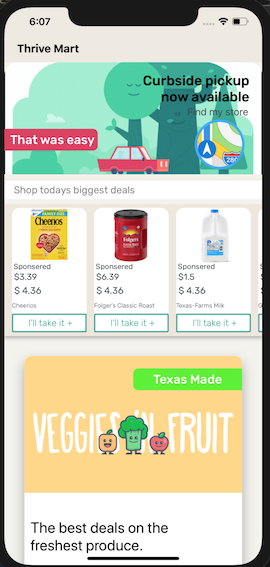
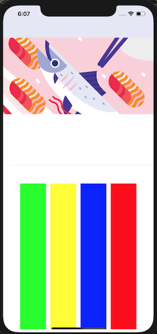
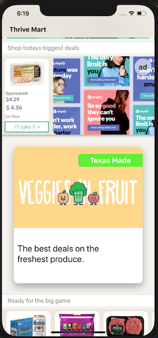

# Thrive Mart

Thrive Mart is a model of a grocery story for iOS. It demonstrations the following common iOS development patterns: Model-View-Controller deisgn architecture, UIKit, Autolayout of views with a programmatic layout (i.e. no storyboards), Nested UICollectionViewController design pattern. 

### Prerequisites

iOS 13.2+
Swift 5+
Xcode 11+

## Contributing

Please read [CONTRIBUTING.md](https://gist.github.com/PurpleBooth/b24679402957c63ec426) for details on our code of conduct, and the process for submitting pull requests to us.

## Versioning

1.0

## Authors

* **Arturo Arriaga** - *Initial work* - [ArturoArriaga](https://github.com/ArturoArriaga)

## License

This project is licensed under the MIT License - see the [LICENSE.md](LICENSE.md) file for details

## Acknowledgments

* Matt Neuburg - Programming IOS 13: Dive Deep Into Views, View Controllers, and Frameworks
* Inspiration - Cuberto, San Francisco, CA

